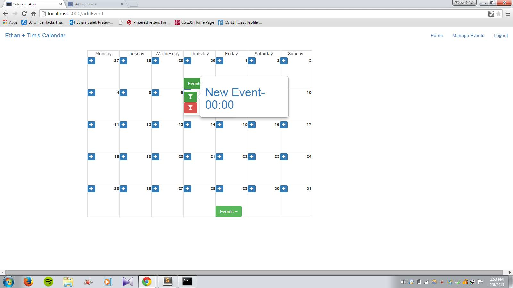
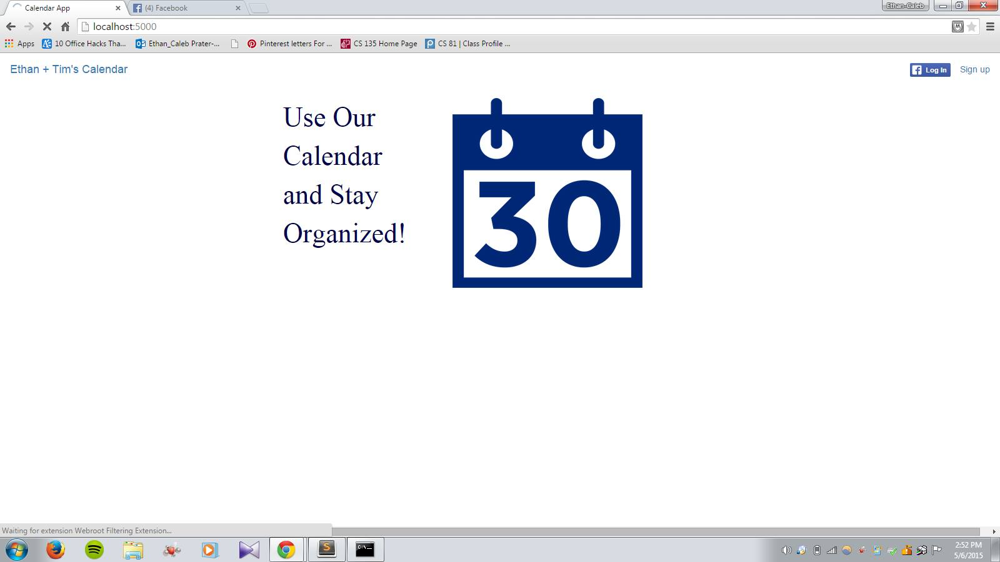

# Calendar Project Writeup

---

For our final project for CS 131 (Distributed Systems) at Claremont McKenna College, we created a Calendar appliation that allows users to organize their events in one place -  similar to Gmail Calendar or the iCal application on Macs. 

Instead of emulating the structure of other Calendar programs, our goal was to add new features that increased usability and productivity for our users. Here is a short list of some features that we added: 
- *Facebook Integration* : Upon logging in, we use OAUTH and the Facebook Graph API to get information about all of the Facebook events that the user plans to attend. 
- *Text/Sentiment Analysis* : Using an external text analysis engine called [Alchemy API](http://alchemyapi.com), we were able to determine the document sentiment (positive, neutral, negative) of each of the users Facebook events. For instance, if the user is attending an event called "Free Donuts Today!!" it would return a positive sentiment, whereas the event "Protest Unfair Wages!" would return a negative sentiment. All of the Facebook events and the corresponding sentiment of each event is shown on the Calendar - see image below. Events in green indicate positive sentiment, gray events are neutral, and red events are negative. 




After we completed the additional features described above, our basic goals for the project were met, as we were able to log-in on Facebook, and have all of our events/sentiments shown on the calendar. Additional screenshots are available in the `img` folder. 


## Key Ideas

While many of the key ideas from class are implemented in our project, we tried to broaden our horizons by using languages/software not talked about in class. Our entire backend was written in Flask (we used PHP in class), and we were able to minimize the amount of CSS by using a web framework called [Bootstrap](http://getbootstrap.com). We handle user interaction with jquery methods to create interactive forms and popovers. We minimized forms to avoid html injection and we added checks to prevent users accessing pages when not logged in or by invalid methods such as posting to a page not meant to handle posts. In addition, we used a NoSQL database (an unstructured alternative to the relational model of MySQL) called [Couchbase](http://couchbase.com). We chose to use Couchbase because it is a column-oriented key-value datastore that is well suited for OLAP transactions. (Couchbase also satisfies consistency and partition tolerance - CP of the CAP theorem for NoSQL databases, but this is a little beyond the scope of this course). By using Flask, Couchbase, Bootstrap and Alchemy API (text processing), we were able to incorporate many of the concepts/ideas from class. 

## Future Plans

If we had more time to work on the project, we would ideally like to :
- Integrate user events from other sources (Email, Twitter?)
- Allow users to invite other users to events (user-to-user interaction)

## Setup and Running the App

First install Flask, Couchbase and request an Alchemy API access-token. Then start up couchbase and run the app:

```
> git clone http://github.com/epf02013/calendarApp
> cd calendarApp
> python app.py

```

If you direct your web-browser to `http://localhost:5000`, you should see the screen below. 


